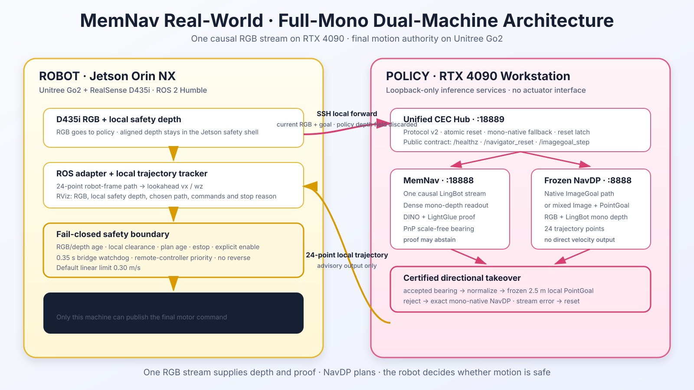

# MemNav Real-World

Real-world ImageGoal and revisit navigation on a Unitree Go2. An RTX 4090
workstation runs MemNav certified episodic relocalization and frozen NavDP;
the Jetson Orin NX keeps RGB-D synchronization, local trajectory tracking,
motor safety and final stop authority on the robot.

> 中文部署细节见
> [deployment/go2/README_CN.md](deployment/go2/README_CN.md)，双机联调记录见
> [REALWORLD_GO2_DUAL_MACHINE_DEPLOYMENT_20260818.md](REALWORLD_GO2_DUAL_MACHINE_DEPLOYMENT_20260818.md)。

## Reference Platform

  

| Role | Compute | Platform / sensor | Responsibility |
| --- | --- | --- | --- |
| Policy workstation | NVIDIA RTX 4090 | Ubuntu workstation | MemNav causal memory, DINO retrieval, LightGlue + LingBot/PnP certificate, frozen NavDP |
| Robot computer | Jetson Orin NX 16 GB | Unitree Go2 + RealSense D435i | Aligned RGB-D, ROS adapter, trajectory tracking, RViz, watchdog and Unitree control |

This deployment does **not** use TinyNav VIO, mapping or planning. The working
TinyNav Python environment may only be reused for CycloneDDS and Unitree SDK
packages on the Jetson.

## System Architecture

  

The workstation never publishes velocity and does not load the Unitree SDK.
It returns one 24-point robot-local trajectory through a loopback-only service
reached by an SSH tunnel. The Jetson converts that path into
<code>/navdp/cmd_vel</code> only after its own RGB-D freshness,
depth-clearance, command-age, estop and operator-enable checks pass.

### Online ImageGoal Route

1. The Jetson sends synchronized current RGB, aligned depth and the fixed goal image.
2. MemNav appends the observation once and proposes causal history candidates.
3. A geometric certificate verifies or rejects a revisit bearing.
4. An accepted bearing is normalized and projected to a frozen 2.5 m local PointGoal.
5. Frozen NavDP runs mixed ImageGoal + PointGoal control; rejection uses native ImageGoal NavDP exactly.
6. The Jetson tracks the returned local path at a tested default limit of <code>0.30 m/s</code>.

MemNav is therefore a certified directional memory layer, not a metric global
planner. NavDP remains the local RGB-D trajectory policy. See
[ARCHITECTURE.md](ARCHITECTURE.md) for state and failure semantics.

## Safety Contract

- Motion is locked at startup and requires an explicit ROS service call.
- RGB-D timeout, excessive RGB/depth skew, stale trajectory or invalid depth produces zero velocity.
- The Go2 bridge has an independent <code>0.35 s</code> watchdog and hand-controller priority.
- The policy service is loopback-only; the robot reaches it through an SSH local forward.
- MemNav failure sticks to native NavDP until reset; uncertain NavDP state requires a full reset.
- The RTX workstation has no direct actuator path; the Jetson retains final authority.

The software guards do not replace an onsite operator, a clear test area,
tethering for first motion, or the Unitree hand controller.

## Repository Layout

| Path | Contents |
| --- | --- |
| <code>deployment/go2/</code> | D435i, ROS 2 adapter, RViz, ImageGoal evaluator, Go2 bridge and tests |
| <code>deployment/go2/offboard/</code> | Jetson-to-workstation SSH tunnel and dual-machine launcher |
| <code>deployment/gpu/</code> | Auditable CEC router, fixed-bearing adapter, GPU launch scripts and tests |
| <code>baselines/navdp/</code> | Upstream frozen NavDP implementation used for native and mixed control |
| <code>baselines/x-navdp/</code> | Upstream X-NavDP baseline and Jetson compatibility fixes |
| <code>REALWORLD_GO2_DUAL_MACHINE_DEPLOYMENT_20260818.md</code> | Dated integration evidence and measured limitations |

Model checkpoints, research datasets, local environments, runtime buffers,
captured goal images and experiment results are intentionally excluded.

## Reproduction

### 1. Verify the Checkout

~~~bash
git clone git@github.com:AlanZhu2006/Memnav_Realworld.git
cd Memnav_Realworld

python3 tools/verify_public_baseline.py --workspace .
python3 -m pip install -r deployment/gpu/requirements.txt pytest
python3 -m pytest -q deployment/gpu/tests
# Run on the configured Jetson environment:
.venv-navdp/bin/python -m unittest discover -v deployment/go2/tests
~~~

These tests do not connect to the robot or issue motion commands.

### 2. Start the RTX 4090 Policy Stack

The MemNav research source and all checkpoints remain external. Copy the
environment template and point it to licensed local artifacts:

~~~bash
cp deployment/gpu/env.example deployment/gpu/.env
nano deployment/gpu/.env

bash deployment/gpu/scripts/preflight.sh
bash deployment/gpu/scripts/run_policy_stack.sh
curl -fsS http://127.0.0.1:18889/healthz
~~~

All three GPU services bind to loopback by default:

| Service | Port |
| --- | ---: |
| Frozen NavDP | <code>8888</code> |
| MemNav / certificate service | <code>18888</code> |
| Unified CEC hub | <code>18889</code> |

### 3. Prepare the Jetson

~~~bash
bash deployment/go2/scripts/download_weights.sh all
bash deployment/go2/scripts/setup_jetson.sh
bash deployment/go2/scripts/preflight.sh --backend base
~~~

Set the workstation SSH alias or export it explicitly:

~~~bash
export CEC_HUB_SSH_HOST=user@gpu-workstation
bash deployment/go2/offboard/run_policy_tunnel.sh
~~~

### 4. Capture an Image Goal

With navigation stopped, move the Go2 to the goal pose using the hand
controller, keep it stationary and capture synchronized RGB-D:

~~~bash
bash deployment/go2/scripts/run_realsense.sh
bash deployment/go2/scripts/capture_imagegoal_reference.sh
~~~

Goal files stay under the ignored <code>deployment/go2/goals/</code> runtime
directory.

### 5. Dry-Run Before Motion

~~~bash
export CEC_HUB_SSH_HOST=user@gpu-workstation
bash deployment/go2/offboard/preflight_offboard.sh
bash deployment/go2/offboard/run_offboard_stack.sh --with-rviz
tmux attach -t navdp-go2-offboard
~~~

Confirm live RGB, aligned depth, candidate paths, selected path, inference
latency and zero <code>/navdp/cmd_vel</code> while the adapter remains disabled.

### 6. Supervised Go2 Run

Only after the dry-run and bearing-sign calibration pass:

~~~bash
bash deployment/go2/offboard/stop_offboard_stack.sh
bash deployment/go2/offboard/run_offboard_stack.sh --with-go2 --with-rviz

source /opt/ros/humble/setup.bash
ros2 service call /navdp_go2_adapter/set_enabled \
  std_srvs/srv/SetBool "{data: true}"
~~~

Immediate stop:

~~~bash
ros2 topic pub --once /navdp/estop std_msgs/msg/Bool "{data: true}"
ros2 service call /navdp_go2_adapter/set_enabled \
  std_srvs/srv/SetBool "{data: false}"
bash deployment/go2/offboard/stop_offboard_stack.sh
~~~

## Current Status

As of **2026-08-18**, the loopback services, unified route, Jetson SSH tunnel,
real D435i dry-run and tunnel-loss fail-closed behavior have been exercised.
The local Go2 bridge and <code>0.30 m/s</code> motion limit were previously
exercised with the robot. The complete offboard CEC stack has **not** yet
completed a formal powered Go2 campaign, bearing-sign calibration or long-run
p99 latency test. No real-world SR/SPL claim is made here.

See [CURRENT_STATUS.md](CURRENT_STATUS.md) before any new experiment.

## Documentation

- [RUNBOOK.md](RUNBOOK.md): current start, inspect, stop and revisit sequence.
- [ARCHITECTURE.md](ARCHITECTURE.md): responsibilities, routing and fail-closed behavior.
- [SOURCE_MANIFEST.md](SOURCE_MANIFEST.md): source snapshot and excluded artifacts.
- [THIRD_PARTY_NOTICES.md](THIRD_PARTY_NOTICES.md): upstream code and model notices.
- [deployment/go2/README_CN.md](deployment/go2/README_CN.md): complete Jetson/Go2 guide in Chinese.

## Upstream NavDP

This repository is built on
[InternRobotics/NavDP](https://github.com/InternRobotics/NavDP) and retains its
benchmark and baseline source history. Upstream code is distributed under the
terms stated by that project; X-NavDP and bundled third-party components keep
their own license files. This repository does not redistribute model weights.

If this project is useful, cite the upstream NavDP work:

~~~bibtex
@misc{navdp,
  title={NavDP: Learning Sim-to-Real Navigation Diffusion Policy with Privileged Information Guidance},
  author={Wenzhe Cai and Jiaqi Peng and Yuqiang Yang and Yujian Zhang and Meng Wei and Hanqing Wang and Yilun Chen and Tai Wang and Jiangmiao Pang},
  year={2025},
  booktitle={arXiv}
}
~~~
