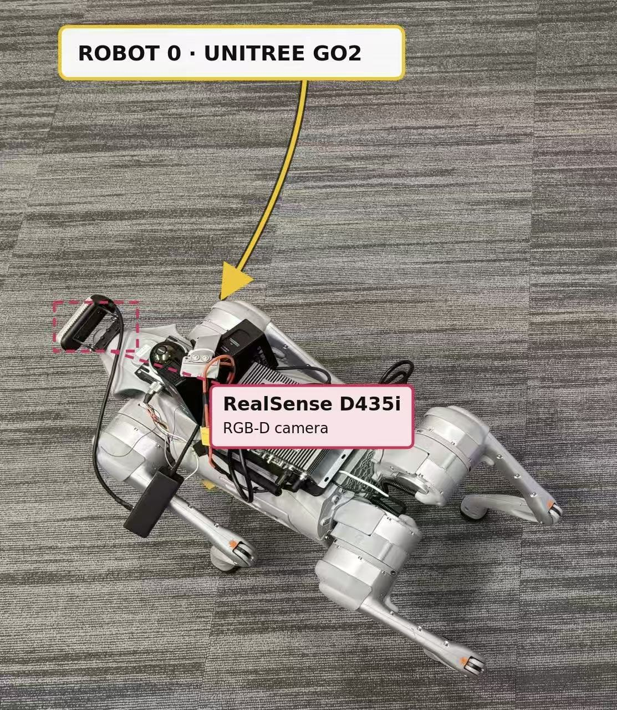
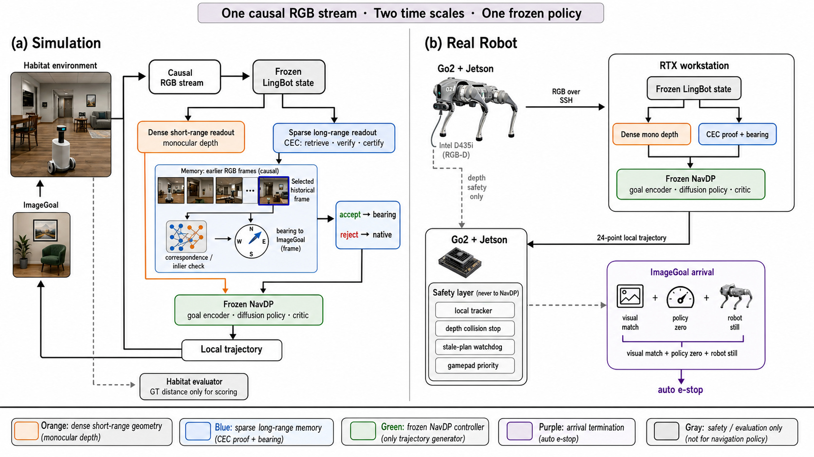
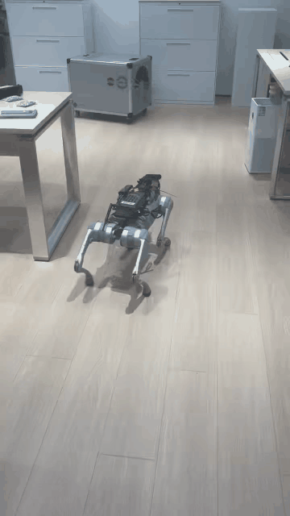
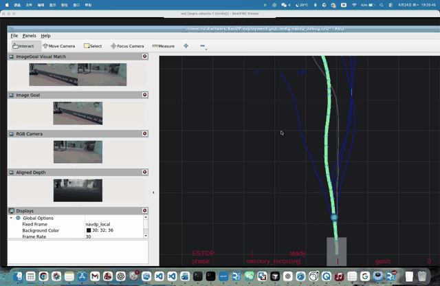

# MemNav Real-World

Real-world monocular ImageGoal and revisit navigation on a Unitree Go2. An RTX
4090 workstation runs one causal RGB stream through LingBot-backed MemNav,
Certified Episodic Compass (CEC), and frozen NavDP. The Jetson Orin NX keeps
aligned depth only inside the local collision-safety layer, together with
trajectory tracking, motor safety and final stop authority on the robot.

## Experiment Handbook

The complete Chinese field protocol, from scene registration and sealed Survey
through supervised motion, dual-view evidence, SR/SPL and failure handling, is
maintained in
[REALWORLD_EXPERIMENT_HANDBOOK_CN.md](REALWORLD_EXPERIMENT_HANDBOOK_CN.md).
Use it as the primary experiment and handoff entry point, together with the
latest claim boundary in [CURRENT_STATUS.md](CURRENT_STATUS.md).

## Runtime Entry Points

For an ad-hoc baseline or Full-Mono run, `nav_stack.sh` provides one profile
and arrival vocabulary:

~~~bash
bash deployment/go2/nav_stack.sh list
bash deployment/go2/nav_stack.sh describe native-navdp-rgbd
bash deployment/go2/nav_stack.sh describe fullmono-lingbot-cec
bash deployment/go2/nav_stack.sh status
~~~

The profile facade delegates native runs to `scripts/run_stack.sh` and
Full-Mono runs to `offboard/fullmono.sh`. The latter remains a supported direct
two-machine lifecycle command and is also used by the formal
`offboard/revisit_experiment.sh` workflow. Only
`offboard/run_offboard_stack.sh` is a Jetson-local implementation detail.
Arrival defaults safely to `operator`, though experiment commands should spell
it out.

## Reference Platform

  

| Role | Compute | Platform / sensor | Responsibility |
| --- | --- | --- | --- |
| Policy workstation | NVIDIA RTX 4090 | Ubuntu workstation | One causal RGB stream, LingBot dense mono-depth readout, CEC proof, frozen NavDP |
| Robot computer | Jetson Orin NX 16 GB | Unitree Go2 + RealSense D435i | RGB transport, local aligned-depth collision guard, trajectory tracking, watchdog and Unitree control |

This deployment does **not** use TinyNav VIO, mapping or planning. The working
TinyNav Python environment may only be reused for CycloneDDS and Unitree SDK
packages on the Jetson.

## System Architecture

  

The workstation never publishes velocity and does not load the Unitree SDK.
It returns one 24-point robot-local trajectory through a loopback-only service
reached by an SSH tunnel. The Jetson converts that path into
<code>/navdp/cmd_vel</code> only after its own RGB/depth freshness,
depth-clearance, command-age, estop and operator-enable checks pass. Jetson
depth is never forwarded into the navigation policy.

## Real-Robot Demo

The clips below are engineering reference footage supplied on 2026-08-27, not
a formal SR/SPL result. The external view shows physical Go2 motion; the RViz
dashboard shows the ImageGoal, current RGB, aligned safety depth, visual match,
candidate trajectories, selected trajectory and live control state.

<table width="100%">
  <tr>
    <td width="35%" align="center" valign="top">
      <strong>Third-person view</strong> 
       
      <a href="media/demo/revisit_reference_third_view.mp4">H.264 MP4</a>
    </td>
    <td width="65%" align="center" valign="top">
      <strong>First-person RViz dashboard</strong> 
       
      <a href="media/demo/revisit_reference_dashboard.mp4">H.264 MP4</a>
    </td>
  </tr>
</table>

Formal runs use one run ID to bind the ROS bag, readable CEC/status receipts,
RViz recording and external third-view master into a SHA-256 manifest. See
[EXPERIMENT_DATA_COLLECTION.md](EXPERIMENT_DATA_COLLECTION.md).

### Online ImageGoal Route

1. A survey pass records exact causal RGB memory and memory-excluded supported goal candidates.
2. The sealed dataset is restarted and verified before the formal Revisit pass.
3. The task-boundary transaction selects and installs one candidate, then reconstructs NavDP's short observation FIFO.
4. Each query appends current RGB exactly once; LingBot exposes dense short-range mono depth and sparse long-range proof evidence from the same state.
5. CEC either certifies a scale-free revisit bearing or abstains.
6. An accepted bearing is normalized onto a frozen 2.5 m local PointGoal; rejection uses exact mono-native ImageGoal NavDP.
7. A failed causal stream update latches <code>reset_required</code>; it cannot silently fall back to metric depth.
8. The Jetson tracks the returned local path at a tested default limit of <code>0.30 m/s</code>.

MemNav is therefore a certified directional memory layer, not a metric global
planner. NavDP remains the sole local trajectory policy, but its observation
depth is reconstructed from the same causal monocular stream. See
[ARCHITECTURE.md](ARCHITECTURE.md) for state and failure semantics.

## Planned Real-World Evaluation

The registered conference campaign uses four frozen scenes and five matched
native/CEC blocks per scene: 20 pairs and 40 physical rollouts.  Ten blocks are
native-first and ten CEC-first.  No formal run has been entered; every dash is
an intentionally blank value, not zero.

| Method | Planned rollouts | Completed | Novel SR | Revisit SR | Overall SR | SPL |
| --- | ---: | ---: | ---: | ---: | ---: | ---: |
| Frozen mono NavDP | `20` | `0` | `—` | `—` | `—` | `—` |
| Frozen mono NavDP + CEC | `20` | `0` | `—` | `—` | `—` | `—` |

`SPL_i = S_i L_i / max(L_i, P_i)`, where `L_i` is the independently
predeclared shortest feasible scene path and `P_i` is an independently
measured physical Go2 path. Results remain blocked until the separate arrival
and path-measurement contracts are frozen. See the
[paired scene registry](REALWORLD_EVALUATION.md) and
[machine-readable plan](manifests/realworld_paired_evaluation_plan_v2.json).

## Independent Odin1 Reference Lane

An evaluation-only Odin1 stack is included under
[`deployment/odin1_gt/`](deployment/odin1_gt/README_CN.md). It performs one
out-and-back mode-1 mapping survey, hash-binds the D435i goal image to an Odin
map pose, requires stable mode-2 `map -> odom` relocalization, integrates
independent odometry path length and computes frozen-grid A* SPL receipts.

Odin data never enters CEC, NavDP, D435i collision safety or Go2 control. The
honest claim is **independent reference SLAM**, not motion-capture-grade
metrological ground truth. The code is implemented and tested offline, but the
official `v0.14.0` native-Mode1 driver has been compiled locally. The current
release has not yet produced a hash-bound live/calibration receipt on this Go2,
so all formal SR/SPL fields remain blank. The old 0.13.1 cold-start patch is an
explicit legacy fallback only.

## Safety Contract

- Motion is locked at startup and requires an explicit ROS service call.
- RGB/depth timeout, excessive synchronization skew, stale trajectory or invalid local safety depth produces zero velocity.
- The Go2 bridge has an independent <code>0.35 s</code> watchdog and hand-controller priority.
- The policy service is loopback-only; the robot reaches it through an SSH local forward.
- Certificate rejection falls back exactly to mono-native NavDP. A causal stream failure or uncertain NavDP state requires a full reset.
- The RTX workstation has no direct actuator path; the Jetson retains final authority.

The software guards do not replace an onsite operator, a clear test area,
tethering for first motion, or the Unitree hand controller.

## Repository Layout

| Path | Contents |
| --- | --- |
| <code>deployment/go2/</code> | D435i, ROS 2 adapter, RViz, ImageGoal evaluator, Go2 bridge and tests |
| <code>deployment/go2/nav_stack.sh</code> | Unified profile launcher separating native NavDP, Full-Mono CEC/LingBot and arrival authority |
| <code>deployment/go2/offboard/</code> | Jetson-to-workstation SSH tunnel and dual-machine launcher |
| <code>deployment/go2/offboard/experiment_capture.sh</code> | ROS bag, receipt, RViz and third-view evidence binding for each run |
| <code>deployment/odin1_gt/</code> | Independent Odin mapping, relocalization, arrival, path and A* SPL evidence lane |
| <code>deployment/gpu/</code> | Auditable CEC router, fixed-bearing adapter, GPU launch scripts and tests |
| <code>baselines/navdp/</code> | Frozen NavDP plus audited mono-sidecar and state-safe inference interfaces |
| <code>baselines/x-navdp/</code> | Upstream X-NavDP baseline and Jetson compatibility fixes |
| <code>REALWORLD_EXPERIMENT_HANDBOOK_CN.md</code> | Complete Chinese experiment, safety, evidence, metric and handoff protocol |
| <code>REALWORLD_EVALUATION.md</code> | Planned four-scene, five-paired-block native/CEC registry with empty result slots |
| <code>docs/</code> | Documentation index and archived historical integration/release records |

Model checkpoints, research datasets, local environments, runtime buffers and
raw experiment evidence are intentionally excluded. Curated engineering demo
derivatives are indexed in [media/README.md](media/README.md).

## Reproduction

### 1. Verify the Checkout

~~~bash
git clone git@github.com:AlanZhu2006/MemNav-RealWorld.git
cd MemNav-RealWorld

python3 tools/verify_public_baseline.py --workspace .
python3 -m pip install -r deployment/gpu/requirements.txt pytest
python3 -m pytest -q deployment/gpu/tests
# Run on the configured Jetson environment:
.venv-navdp/bin/python -m unittest discover -v deployment/go2/tests
~~~

These tests do not connect to the robot or issue motion commands.

### 2. Start the RTX 4090 Policy Stack

The MemNav research source and all checkpoints remain external. Copy the
environment template and point it to licensed local artifacts:

~~~bash
cp deployment/gpu/env.example deployment/gpu/.env
nano deployment/gpu/.env

# This mount was physically measured at 0.42 m; remeasure after mount changes.
export CEC_CAMERA_HEIGHT_M=0.42
bash deployment/gpu/scripts/preflight.sh
bash deployment/gpu/scripts/run_policy_stack.sh
curl -fsS http://127.0.0.1:18889/healthz
~~~

All three GPU services bind to loopback by default:

| Service | Port |
| --- | ---: |
| Frozen NavDP | <code>8888</code> |
| MemNav / certificate service | <code>18888</code> |
| Unified CEC hub | <code>18889</code> |

### 3. Prepare the Jetson

~~~bash
bash deployment/go2/scripts/download_weights.sh all
bash deployment/go2/scripts/setup_jetson.sh
bash deployment/go2/scripts/preflight.sh --backend base
~~~

Set the workstation SSH alias or export it explicitly:

~~~bash
export CEC_HUB_SSH_HOST=user@gpu-workstation
~~~

The Full-Mono profile launcher owns the SSH tunnel and its contract preflight.
`offboard/run_policy_tunnel.sh` remains available only for transport diagnosis.

### 4. Capture an Image Goal

With navigation stopped, move the Go2 to the goal pose using the hand
controller, keep it stationary and capture synchronized RGB-D:

~~~bash
bash deployment/go2/scripts/run_realsense.sh
bash deployment/go2/scripts/capture_imagegoal_reference.sh
~~~

Goal files stay under the ignored <code>deployment/go2/goals/</code> runtime
directory.

### 5. Dry-Run Before Motion

~~~bash
export CEC_HUB_SSH_HOST=user@gpu-workstation
export CEC_CAMERA_HEIGHT_M=0.42
export NAVDP_GOAL=/absolute/path/to/image_goal.png

bash deployment/go2/nav_stack.sh start \
  --profile fullmono-lingbot-cec \
  --goal "$NAVDP_GOAL" \
  --arrival operator \
  --camera-height "$CEC_CAMERA_HEIGHT_M" \
  --with-rviz
tmux attach -t navdp-go2-offboard
~~~

Confirm live RGB, local safety depth, mono-depth receipts, candidate paths,
selected path, inference latency and zero <code>/navdp/cmd_vel</code> while the
adapter remains disabled.

### 6. Supervised Go2 Run

Only after the dry-run and bearing-sign calibration pass:

~~~bash
bash deployment/go2/nav_stack.sh stop
bash deployment/go2/nav_stack.sh start \
  --profile fullmono-lingbot-cec \
  --goal "$NAVDP_GOAL" \
  --arrival operator \
  --camera-height "$CEC_CAMERA_HEIGHT_M" \
  --with-go2 --with-rviz

source /opt/ros/humble/setup.bash
ros2 service call /navdp_go2_adapter/set_enabled \
  std_srvs/srv/SetBool "{data: true}"
~~~

For a formal trial, start the evidence-only recorder before arming:

~~~bash
bash deployment/go2/offboard/experiment_capture.sh preflight
bash deployment/go2/offboard/experiment_capture.sh start RUN_ID \
  --dataset DATASET_ID --trial-kind revisit --profile audit \
  --gt-source none
~~~

The exact stop, third-view import and manifest-finalization workflow is in
[EXPERIMENT_DATA_COLLECTION.md](EXPERIMENT_DATA_COLLECTION.md).

Immediate stop:

~~~bash
ros2 topic pub --once /navdp/estop std_msgs/msg/Bool "{data: true}"
ros2 service call /navdp_go2_adapter/set_enabled \
  std_srvs/srv/SetBool "{data: false}"
bash deployment/go2/nav_stack.sh stop
~~~

## Current Status

As of **2026-08-29**, the repository contains the protocol-v3/bearing-v2
Full-Mono stack, immutable two-pass Revisit datasets, online goal installation,
persistent CEC receipts and the dual-view experiment collector described here.
The base Go2 tracker and safety chain have moved successfully. A tuned RGB-only
commissioning gate has also completed one powered near-goal automatic stop.
That result is not a full arbitrary-start rollout or a formal STOP contract;
formal Full-Mono SR/SPL remains unverified.

For the optional independent Odin1 reference workflow, including the complete
mapping-survey and formal-run command order, use
[`deployment/odin1_gt/README_CN.md`](deployment/odin1_gt/README_CN.md). Do not
set `--gt-source odin1` until its hardware preflight reports a stable
`reference_ready=true` lane.

See [CURRENT_STATUS.md](CURRENT_STATUS.md) before any new experiment.

## Documentation

Use the centralized [documentation index](docs/README.md). Start with
[CURRENT_STATUS.md](CURRENT_STATUS.md) before an experiment; dated release and
integration records live under `docs/archive/` and are not current runbooks.

## Upstream NavDP

This repository is built on
[InternRobotics/NavDP](https://github.com/InternRobotics/NavDP) and retains its
benchmark and baseline source history. Upstream code is distributed under the
terms stated by that project; X-NavDP and bundled third-party components keep
their own license files. This repository does not redistribute model weights.

If this project is useful, cite the upstream NavDP work:

~~~bibtex
@misc{navdp,
  title={NavDP: Learning Sim-to-Real Navigation Diffusion Policy with Privileged Information Guidance},
  author={Wenzhe Cai and Jiaqi Peng and Yuqiang Yang and Yujian Zhang and Meng Wei and Hanqing Wang and Yilun Chen and Tai Wang and Jiangmiao Pang},
  year={2025},
  booktitle={arXiv}
}
~~~
